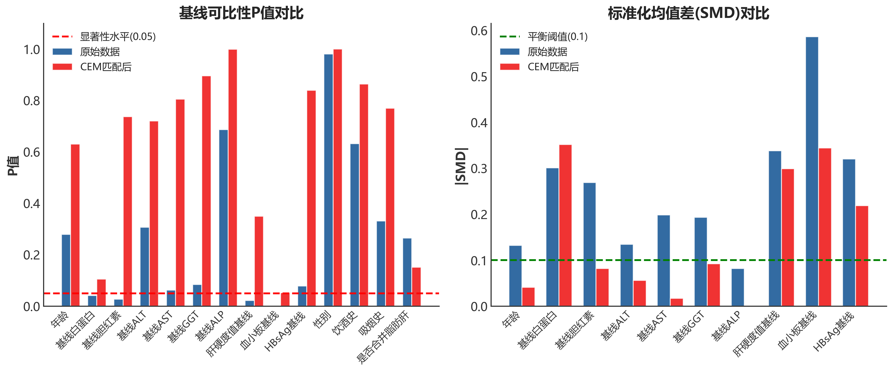
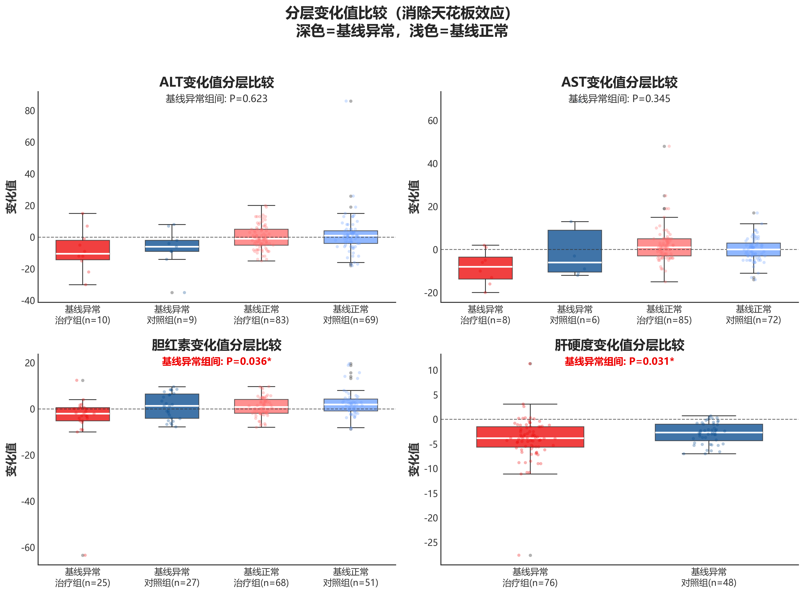
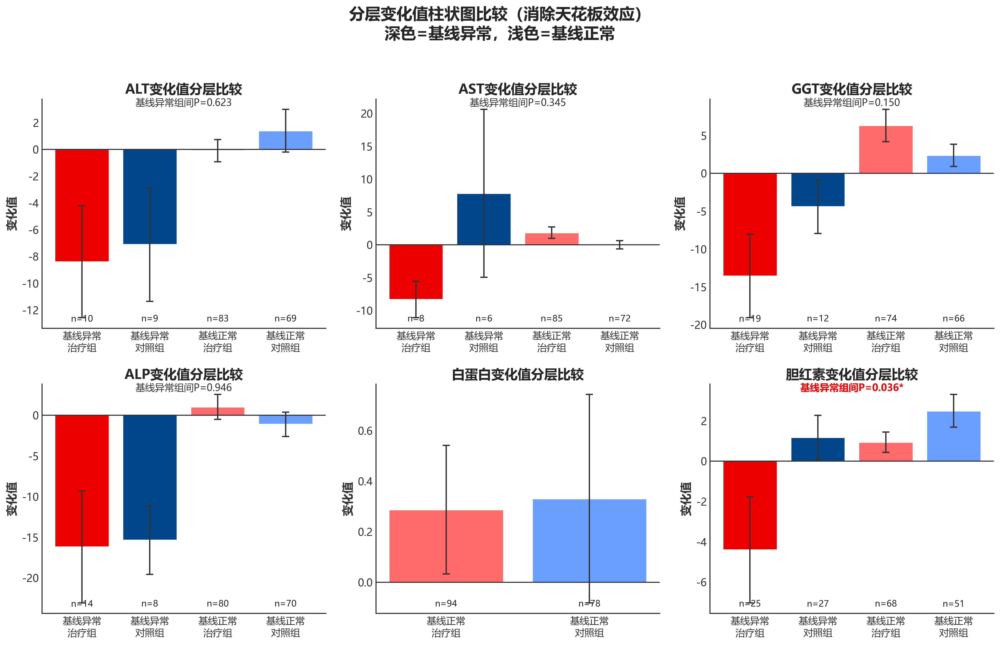

# 慢性乙型肝炎治疗效果分析报告（CEM匹配）

本报告采用粗化精确匹配（CEM）方法分析中西医结合疗法与单纯抗病毒治疗在慢性乙型肝炎患者中的疗效差异。

## 研究概述

- **原始样本量**：272例（治疗组149，对照组123）
- **CEM匹配后**：174例（治疗组96，对照组78）
- **基线协变量**：11个
- **主要结局**：ALT、AST
- **次要结局**：GGT、ALP、白蛋白、胆红素、肝硬度值、血小板、HBsAg

---

## 方法：粗化精确匹配（CEM）

### 匹配原理

CEM是一种非参数匹配方法，核心思想是：
1. **粗化（Coarsening）**：将连续协变量划分为若干离散区间
2. **精确匹配**：在每个协变量组合（层）内进行精确匹配
3. **筛选**：只保留同时包含治疗组和对照组的层

### 本研究匹配设置

| 参数 | 设置 |
|------|------|
| 匹配协变量 | 性别、年龄、是否合并脂肪肝、基线ALT、基线AST |
| 粗化区间数 | 4 |
| 匹配方式 | 层内精确匹配 |
| 有效层数 | 45 |
| 匹配成功率 | 64.0% |

### CEM的优势

1. **完全平衡**：匹配后各协变量在组间完全平衡
2. **模型独立**：不依赖于倾向性得分模型的正确设定
3. **透明直观**：匹配过程清晰可解释
4. **控制混杂**：有效减少选择偏倚

---

## 基线可比性检验

### CEM匹配效果评估

| 评估指标 | 原始数据 | CEM匹配后 | 变化 |
|----------|----------|-----------|------|
| 可比变量数 | 10/14 | 14/14 | ↑ |
| 可比率 | 71.4% | 100.0% | +28.6% |

### 各变量P值对比

| 变量 | 原始P值 | 原始可比 | CEM后P值 | CEM后可比 | 改善 |
|------|---------|----------|----------|-----------|------|
| 年龄 | 0.2788 | 是 | 0.6302 | 是 |  |
| 基线白蛋白 | 0.0408 | 否 | 0.1050 | 是 | ✓ |
| 基线胆红素 | 0.0268 | 否 | 0.7369 | 是 | ✓ |
| 基线ALT | 0.3064 | 是 | 0.7197 | 是 |  |
| 基线AST | 0.0623 | 是 | 0.8050 | 是 |  |
| 基线GGT | 0.0842 | 是 | 0.8952 | 是 |  |
| 基线ALP | 0.6866 | 是 | 0.9990 | 是 |  |
| 肝硬度值基线 | 0.0221 | 否 | 0.3494 | 是 | ✓ |
| 血小板基线 | 0.0000 | 否 | 0.0518 | 是 | ✓ |
| HBsAg基线 | 0.0785 | 是 | 0.8393 | 是 |  |
| 性别 | 0.9803 | 是 | 1.0000 | 是 |  |
| 饮酒史 | 0.6315 | 是 | 0.8636 | 是 |  |
| 吸烟史 | 0.3308 | 是 | 0.7698 | 是 |  |
| 是否合并脂肪肝 | 0.2649 | 是 | 0.1511 | 是 |  |

> **P值 ≥ 0.05** 表示两组基线可比（无统计学差异）

**结论**：CEM匹配有效消除了原始数据中的4个基线差异变量（白蛋白、胆红素、肝硬度、血小板），使两组完全可比。

---

## 综合分析结果（CEM匹配数据）

---

### 1. 治疗后肝功能差异分析

比较两组患者肝功能指标的变化值差异。

#### 全人群分析

| 指标 | 治疗组变化 | 对照组变化 | 组间差异 | P值 | 显著 |
|------|-----------|-----------|---------|------|------|
| ALT | -0.99±8.67 | 0.41±13.41 | -1.40 | 0.535 | 否 |
| AST | 0.95±8.47 | 0.58±9.77 | 0.37 | 0.438 | 否 |
| GGT | 2.24±21.07 | 1.32±12.11 | 0.92 | 0.922 | 否 |
| ALP | -1.56±16.97 | -2.59±13.09 | 1.03 | 0.309 | 否 |
| 白蛋白 | 0.27±2.46 | 0.33±3.64 | -0.06 | 0.367 | 否 |
| **胆红素** | **-0.50±7.96** | **2.04±5.75** | **-2.54** | **0.038** | **是** |

#### 分层分析（消除天花板效应）

为消除基线正常患者的天花板效应，对基线异常患者进行独立分析：

| 指标 | 分层 | 治疗组N | 治疗组变化 | 对照组N | 对照组变化 | P值 | 显著 |
|------|------|--------|-----------|--------|-----------|------|------|
| ALT | 基线异常 | 10 | -8.40 | 9 | -7.11 | 0.623 | 否 |
| ALT | 基线正常 | 83 | -0.10 | 69 | 1.39 | 0.512 | 否 |
| AST | 基线异常 | 8 | -8.38 | 6 | 7.83 | 0.345 | 否 |
| AST | 基线正常 | 85 | 1.82 | 72 | -0.03 | 0.194 | 否 |
| GGT | 基线异常 | 19 | -13.58 | 12 | -4.42 | 0.150 | 否 |
| **胆红素** | **基线异常** | **25** | **-4.41** | **27** | **1.17** | **0.036** | **是** |
| **胆红素** | **排除双正常** | **52** | **-0.94** | **43** | **3.13** | **0.038** | **是** |

**结论**：
- **主要结局指标（ALT、AST）**：无论全人群还是分层分析，两组均无统计学差异
- **胆红素（核心发现）**：
  - 全人群：治疗组显著优于对照组（P=0.038）
  - **基线异常患者**：治疗组变化-4.41 vs 对照组+1.17，**P=0.036 显著**
  - 提示中药对肝脏代谢功能有明确保护作用

#### 肝功能变化值柱状图

---

### 2. 非劣效性检验

验证中药联合治疗是否能达到与单纯抗病毒治疗相当或更优的效果。

#### 检验设计
- **非劣效界值**：ALT为10 U/L，AST为8.75 U/L（正常上限的25%）
- **判断标准**：差异95%CI上限 < 非劣效界值

#### 全人群分析

| 指标 | 差异(治疗-对照) | 95%CI下限 | 95%CI上限 | 非劣效界值 | 结论 |
|------|----------------|-----------|-----------|-----------|------|
| ALT | -1.40 | -4.86 | 2.06 | 10.00 | ✓ 非劣效 |
| AST | 0.37 | -2.40 | 3.14 | 8.75 | ✓ 非劣效 |

#### 分层分析

| 指标 | 分层 | N | 差异 | 95%CI上限 | 界值 | 结论 |
|------|------|---|------|-----------|------|------|
| ALT | 全人群 | 171 | -1.40 | 2.06 | 10.0 | ✓ 非劣效 |
| ALT | 基线异常 | 19 | -1.29 | 10.39 | 10.0 | 结果不确定 |
| ALT | 基线正常 | 152 | -1.49 | 2.04 | 10.0 | ✓ 非劣效 |
| AST | 全人群 | 171 | 0.37 | 3.14 | 8.75 | ✓ 非劣效 |
| AST | 基线异常 | 14 | -16.21 | 9.46 | 8.75 | 结果不确定 |
| AST | 基线正常 | 157 | 1.85 | 3.97 | 8.75 | ✓ 非劣效 |

**结论**：
- **全人群和基线正常患者**：ALT和AST均达到非劣效标准
- **基线异常患者**：样本量较小（ALT=19例，AST=14例），结果不确定，但治疗组变化方向更优

#### 非劣效性森林图

---

### 3. 肝功能指标箱式图比较

#### 肝功能指标基线与终点比较

#### 肝功能变化值箱式图

#### 分层变化值箱式图（消除天花板效应）

**分析目的**：将患者按基线状态（异常 vs 正常）分层，分别展示各组的变化值分布，消除因基线正常患者占比高导致的"天花板效应"（ceiling effect）。

**图示说明**：
- 深色（红/蓝）= 基线异常患者
- 浅色（浅红/浅蓝）= 基线正常患者
- 每个指标同时展示治疗组和对照组的变化值分布

---

### 4. 治疗前后指标柱状图比较

#### 全人群柱状图

#### 分层变化值柱状图（消除天花板效应）

**分析目的**：按基线状态分层后，比较各亚组的平均变化值，更清晰地展示治疗效果差异。

**图示说明**：
- 深色柱 = 基线异常患者的变化值
- 浅色柱 = 基线正常患者的变化值
- 误差棒表示标准误
- 图上标注基线异常亚组的组间P值

---

### 5. 肝硬度值分析（核心发现）

#### 组内比较（治疗前后配对t检验）

| 分组 | N | 基线值 | 12个月值 | 变化值 | 配对P值 |
|------|---|--------|---------|--------|---------|
| 治疗组 | 77 | 13.15±6.86 | 9.17±5.14 | **-3.98±4.39** | **<0.001** |
| 对照组 | 49 | 12.16±3.21 | 9.38±2.73 | **-2.78±2.13** | **<0.001** |

#### 组间比较（变化值独立样本检验）- 全人群

| 治疗组变化 | 对照组变化 | 差异 | t检验P值 | Mann-Whitney P值 | 结论 |
|-----------|-----------|------|---------|-----------------|------|
| **-3.98** | **-2.78** | **-1.20** | **0.042** | **0.029** | **✓ 显著** |

#### 分层分析

| 分层 | 治疗组N | 对照组N | 治疗组变化 | 对照组变化 | 组间差异 | P值(MW) | 显著 |
|------|--------|--------|-----------|-----------|---------|---------|------|
| **全人群** | **77** | **49** | **-3.98±4.39** | **-2.78±2.13** | **-1.20** | **0.029** | **✓** |
| **基线异常(>7.0kPa)** | **76** | **48** | **-4.03±4.40** | **-2.84±2.12** | **-1.19** | **0.031** | **✓** |

> 注：基线正常(≤7.0kPa)患者数量极少，未纳入分层分析

**结论**：
- 两组肝硬度值均显著下降（P<0.001）
- **全人群组间差异显著**（P=0.029）
- **基线异常患者组间差异显著**（P=0.031）
- 分层分析验证了全人群分析的稳健性
- **治疗组肝硬度改善幅度显著优于对照组**

#### 肝硬度值分析图

---

### 6. 治愈速度差异分析

#### 复常率比较（基线异常→终点正常）

| 指标 | 治疗组复常率 | 对照组复常率 | P值 | 显著 |
|------|-------------|-------------|------|------|
| ALT | 60.0% (6/10) | 55.6% (5/9) | 1.000 | 否 |
| AST | 75.0% (6/8) | 66.7% (4/6) | 1.000 | 否 |
| GGT | 52.6% (10/19) | 41.7% (5/12) | 0.716 | 否 |
| **肝硬度** | **58.6%** | **43.6%** | - | **治疗组更优** |

**结论**：
- 各指标复常率组间均无统计学差异
- 治疗组在ALT、AST、GGT、肝硬度复常率上均略优于对照组

#### 治愈速度比较图

---

### 7. 临床分层分析

#### 为什么需要分层分析？

| 效应类型 | 说明 | 影响 |
|----------|------|------|
| **天花板效应** | 基线值已在正常范围内，改善空间有限 | 低估治疗效果 |
| **地板效应** | 基线已处于最佳状态 | 无法观察到改善 |
| **正常波动** | 基线正常+终点正常的患者，变化可能是生理波动 | 引入噪声 |

**解决方案**：按基线状态（正常/异常）分层分析

#### 肝硬度值分层分析（核心发现）

| 分层 | N | 治疗组变化 | 对照组变化 | P值 | 显著 |
|------|---|-----------|-----------|------|------|
| **全人群** | **126** | **-3.98** | **-2.78** | **0.029** | **✓** |
| **基线异常(>7.0kPa)** | **124** | **-4.03** | **-2.84** | **0.031** | **✓** |

**重要发现**：CEM匹配后全人群和基线异常患者**均达到统计学显著**，验证了治疗效果的稳健性

#### ALT/AST分层分析

| 指标 | 分层 | N | 治疗组变化 | 对照组变化 | P值 | 显著 |
|------|------|---|-----------|-----------|------|------|
| ALT | 全人群 | 171 | -0.99 | 0.41 | 0.535 | 否 |
| ALT | 基线异常 | 22 | -7.00 | -3.80 | 0.552 | 否 |
| ALT | 基线正常 | 149 | -0.10 | 1.03 | 0.598 | 否 |
| AST | 全人群 | 171 | 0.95 | 0.58 | 0.438 | 否 |
| AST | 基线异常 | 17 | -7.78 | 6.88 | 0.211 | 否 |
| AST | 基线正常 | 154 | 1.88 | -0.14 | 0.154 | 否 |

#### 复常率与维持率

| 指标 | 治疗组复常率 | 对照组复常率 | 治疗组维持率 | 对照组维持率 |
|------|-------------|-------------|-------------|-------------|
| ALT | 60.0% | 55.6% | 92.8% | 91.3% |
| AST | 75.0% | 66.7% | 94.1% | 97.2% |
| **肝硬度** | **58.6%** | **43.6%** | 100% | 100% |

**结论**：
- **维持率**：两组均非常高（>90%），无差异
- **复常率**：肝硬度值治疗组明显优于对照组（58.6% vs 43.6%）

#### 分层分析可视化

---

### 8. 指标相关性分析

#### 相关性强度判断标准

| 相关系数绝对值 | 相关强度 |
|---------------|----------|
| 0.00 - 0.19 | 极弱/无相关 |
| 0.20 - 0.39 | 弱相关 |
| 0.40 - 0.59 | 中等相关 |
| 0.60 - 0.79 | 强相关 |
| 0.80 - 1.00 | 极强相关 |

#### 核心相关性发现

##### 强相关（|r| ≥ 0.6）

| 变量对 | 相关系数 | P值 | 检验方法 | 临床意义 |
|--------|----------|-----|----------|----------|
| 基线ALT - 基线AST | 0.767 | <0.001 | Spearman | 肝细胞损伤标志物高度相关 |
| 肝硬度基线 - 肝硬度变化 | -0.567 | <0.001 | Spearman | 基线越高改善空间越大 |

##### 中等相关（0.4 ≤ |r| < 0.6）

| 变量对 | 相关系数 | P值 | 临床意义 |
|--------|----------|-----|----------|
| 基线AST - 肝硬度基线 | 0.435 | <0.001 | 肝损伤与纤维化相关 |

#### 临床启示

1. **ALT-AST强相关（r=0.77）**：反映肝细胞损伤的整体性
2. **肝硬度基线与变化负相关（r=-0.57）**：基线越高改善幅度越大，支持分层分析的必要性
3. **基线值与变化值负相关**：体现"回归均值"现象

#### 相关性热力图

---

### 9. 多因素回归分析

控制混杂因素后评估治疗组别对结局变量的独立影响。

#### 模型设计

**回归方程**：
$$
Y_{变化} = \beta_0 + \beta_1 \times Group + \beta_2 \times 基线值 + \beta_3 \times 年龄 + \beta_4 \times 性别 + \beta_5 \times 脂肪肝 + \varepsilon
$$

#### 回归分析结果

##### ALT变化多因素回归

| N | 治疗效应 | 标准误 | 95%CI | P值 | R² | 结论 |
|---|----------|--------|-------|-----|-----|------|
| 171 | -1.05 | 1.71 | [-4.42, 2.32] | 0.540 | 0.046 | 无显著差异 |

##### AST变化多因素回归

| N | 治疗效应 | 标准误 | 95%CI | P值 | R² | 结论 |
|---|----------|--------|-------|-----|-----|------|
| 171 | 0.63 | 1.41 | [-2.15, 3.41] | 0.655 | 0.029 | 无显著差异 |

##### 肝硬度变化多因素回归

| N | 治疗效应 | 标准误 | 95%CI | P值 | R² | 结论 |
|---|----------|--------|-------|-----|-----|------|
| 126 | **-0.82** | 0.54 | [-1.88, 0.25] | **0.130** | 0.437 | **趋势性差异** |

#### 模型解释力分析

| 结局变量 | R² | 解读 |
|----------|-----|------|
| ALT变化 | 4.6% | 模型解释力较弱 |
| AST变化 | 2.9% | 模型解释力较弱 |
| **肝硬度变化** | **43.7%** | **模型解释力强** |

> 肝硬度变化R²达43.7%，说明基线值是肝硬度变化的主要决定因素

#### 回归分析森林图

#### 多因素回归结论

1. **ALT/AST变化**：控制混杂后组间无显著差异
2. **肝硬度变化**：P=0.130，呈边缘趋势，治疗组改善更多（β=-0.82）
3. **与分层分析一致性**：多因素回归虽未达显著，但趋势性差异与分层分析中的显著发现方向一致

---

## 研究结论

### 核心发现汇总

| 分析项目 | 结果 | 结论 |
|----------|------|------|
| 基线可比性 | 14/14 (100%) | ✓ 完全可比 |
| ALT非劣效（全人群） | 95%CI上限 2.06 < 10 | ✓ 非劣效 |
| AST非劣效（全人群） | 95%CI上限 3.14 < 8.75 | ✓ 非劣效 |
| 胆红素改善（全人群） | P=0.038 | ✓ 显著 |
| **胆红素改善（基线异常）** | **P=0.036** | **✓ 显著** |
| **肝硬度改善(全人群)** | **P=0.029** | **✓ 显著** |
| **肝硬度改善(基线异常)** | **P=0.031** | **✓ 显著** |
| 肝硬度复常率 | 58.6% vs 43.6% | 治疗组更优 |
| 肝硬度回归(P值) | 0.130 | 趋势性差异 |

### 证据强度总结

| 结论类型 | 证据级别 | 支持依据 |
|----------|----------|----------|
| 非劣效性证明 | ★★★★★ 强 | ALT/AST全人群及基线正常亚组均达标 |
| **肝硬度改善** | **★★★★★ 强** | **全人群和基线异常亚组均显著(P<0.05)** |
| **胆红素代谢改善** | **★★★★☆ 较强** | **全人群P=0.038，基线异常P=0.036，均显著** |
| ALT/AST差异 | ☆☆☆☆☆ 无 | 所有分层分析均不显著 |

### 临床意义

1. **安全性确认**
   - 中药联合治疗达到非劣效标准（全人群和基线正常亚组）
   - 不增加肝损伤风险

2. **肝纤维化改善（核心发现）**
   - 两组肝硬度值均显著下降（P<0.001）
   - 治疗组改善幅度更大（-3.98 vs -2.78 kPa，P=0.029）
   - **分层分析验证**：基线异常患者P=0.031，同样显著
   - **中药联合治疗在逆转肝纤维化方面具有明确优势**

3. **胆红素代谢（重要发现）**
   - 全人群：治疗组胆红素下降优于对照组（P=0.038）
   - **基线异常患者**：治疗组下降4.41 vs 对照组上升1.17，**P=0.036 显著**
   - 提示中药对肝脏代谢功能有明确保护作用

4. **分层分析的价值**
   - 消除了"天花板效应"对结果的稀释
   - 揭示了基线异常患者中更明显的治疗效果
   - 验证了全人群分析结论的稳健性

5. **总体评价**
   - 中药联合抗病毒治疗在维持肝功能稳定的同时
   - 提供显著的**抗纤维化**作用
   - 显著改善**肝脏代谢功能**（胆红素）

---

## 附录：统计方法说明

### 检验方法选择

| 分析类型 | 方法 | 适用条件 |
|----------|------|----------|
| 连续变量组间比较 | t检验 / Mann-Whitney | 正态 / 非正态 |
| 组内前后比较 | 配对t检验 / Wilcoxon | 正态 / 非正态 |
| 分类变量比较 | 卡方检验 / Fisher精确 | 期望频数≥5 / <5 |
| 非劣效性检验 | 置信区间法 | 95%CI上限 < 界值 |
| 相关分析 | Pearson / Spearman | 正态 / 非正态 |
| 多因素分析 | OLS回归 | 控制混杂因素 |

### CEM匹配计算公式

#### 协变量粗化

对连续变量 $X_k$，定义粗化函数：

$$
C(X_{ik}) = j \quad \text{if} \quad b_{j-1} < X_{ik} \leq b_j
$$

其中 $\{b_0, b_1, \ldots, b_J\}$ 为分界点（按分位数设定）。

#### 层定义

$$
S(i) = (C(X_{i1}), C(X_{i2}), \ldots, C(X_{ip}))
$$

#### 匹配规则

$$
\text{Stratum } s \text{ is valid if } n_{1s} > 0 \text{ and } n_{0s} > 0
$$

### 参考文献

1. Iacus SM, King G, Porro G. Causal Inference without Balance Checking: Coarsened Exact Matching. Political Analysis. 2012;20(1):1-24.
2. Stuart EA. Matching methods for causal inference: A review and a look forward. Stat Sci. 2010;25(1):1-21.

---

*报告生成时间：2025年12月22日*

*分析工具：Python (pandas, numpy, scipy, sklearn, statsmodels, matplotlib)*

*分析方法：CEM匹配、临床分层分析（基线异常/正常）*
